# coriell

Helper functions for common bioinformatics tasks. If you find yourself reusing 
old code over and over, let me know and we'll create a function and put it in 
this package. 

I will be adding tests, however, **please test functions and let me know when 
things are broken** by either raising an issue on Github or contacting me.

## Installation

Since this package will be constantly changing be sure to install the latest 
version from Github using:

```R
# Make sure you have devtools installed
install.packages("devtools")

# Then install using devtools::install_github
devtools::install_github("coriell-research/coriell")
```

## Examples

For an overview of how to use some of these functions in a typical 
analysis check out the [RNA-seq vignette](https://coriell-research.github.io/coriell/articles/RNA-seq-workflow.html) (more vignettes to come)

- [Correlate methylation data with age](https://coriell-research.github.io/coriell/#perform-correlation-permutation-test-using-multiple-cores)
- [Create a null distribution of correlations](https://coriell-research.github.io/coriell/#extract-random-correlations-from-a-dataframe)
- [Convert edgeR results into tidy dataframes](https://coriell-research.github.io/coriell/#convert-edger-results-into-a-tidy-dataframe)
- [Summarize results from differential expression analysis](https://coriell-research.github.io/coriell/#summarize-results-from-differential-expression-test)
- [Create volcano plot from differential expression results](https://coriell-research.github.io/coriell/#create-volcano-plot-from-differential-expression-results)
- [Create md plot from differential expression results](https://coriell-research.github.io/coriell/#create-md-plot-from-differential-expression-results)
- [Heatmap with sensible defaults](https://coriell-research.github.io/coriell/#heatmap-with-sensible-defaults)
- [Z-score a dataframe](https://coriell-research.github.io/coriell/#z-score-a-dataframe)
- [Convert a list of sets into a binary matrix](https://coriell-research.github.io/coriell/#convert-a-list-of-sets-into-a-binary-matrix)
- [Get statistics for all pairwise combinations of a list of sets](https://coriell-research.github.io/coriell/#get-statistics-for-all-pairwise-combinations-of-a-list-of-sets)
- [Perform Gene Ontology Analysis with PANTHER](https://coriell-research.github.io/coriell/#perform-gene-ontology-analysis-with-panther)
- [Subsample a count matrix](https://coriell-research.github.io/coriell/#subsample-a-count-matrix)

### Perform correlation permutation test using multiple cores

Note: if the number of possible permutations of your data is less than the 
desired number of permutations given by the parameter `n_perm` then an exact 
test on all of the real permutations will be performed instead of random 
sampling. For example, if you only have 6 samples (720 possible permutations)
but set `n_perm = 1000` only 720 permutations (i.e. the exact test) will be 
tested. The `permutation_correlation_test` function will display a message if 
this occurs. The function accepts a numeric matrix as input or a data.frame that
can be converted to a numeric matrix. In the case a data.frame is passed to
argument `X`, the function call will display a message confirming the conversion.
In most cases this conversion is inconsequential.

```R
library(coriell)
library(methylKit)

# define age dataframe -- ages matching column order
ages = data.frame(age = c(30, 80, 34, 30, 80, 40, 35, 80))

# simulate a methylation dataset
sim_meth <- dataSim(
  replicates = 8,
  sites = 1000,
  treatment = c(rep(1, 4), rep(0, 4)),
  covariates = ages,
  sample.ids = c(paste0("test", 1:4), paste0("ctrl", 1:4))
)

# extract the methylation as percentages and coerce to data.frame
perc_meth <- as.data.frame(percMethylation(sim_meth))

head(perc_meth)
>       test1     test2     test3     test4    ctrl1     ctrl2     ctrl3      ctrl4
> 1  48.14815  54.05405  45.45455  57.89474 32.46753 24.418605  4.687500  30.769231
> 2   0.00000   0.00000   0.00000   0.00000  0.00000  0.000000  0.000000   0.000000
> 3  38.20598  16.34615  12.50000  60.00000 25.42373  3.636364 18.421053  32.335329
> 4 100.00000 100.00000 100.00000 100.00000 86.15385 72.340426 86.666667 100.000000
> 5   0.00000   0.00000   0.00000   0.00000  0.00000  0.000000  0.000000  10.526316
> 6  26.98413  12.63158  23.07692  10.00000 22.22222  0.000000  3.174603   4.166667

# permutation testing -----------------------------------------------------------
# perform permutation testing using 4 cores and 10000 permutations
res <- permutation_correlation_test(
  X = perc_meth, 
  y = ages$age, 
  n_cores = 4, 
  n_perm = 10000,
  method = "spearman" 
  )

head(res)
>       test1     test2     test3     test4    ctrl1     ctrl2     ctrl3      ctrl4        cor empirical.p       fdr
> 1  48.14815  54.05405  45.45455  57.89474 32.46753 24.418605  4.687500  30.769231 -0.3437200      0.1925 0.4812073
> 2   0.00000   0.00000   0.00000   0.00000  0.00000  0.000000  0.000000   0.000000         NA          NA        NA
> 3  38.20598  16.34615  12.50000  60.00000 25.42373  3.636364 18.421053  32.335329 -0.3559957      0.1903 0.4812073
> 4 100.00000 100.00000 100.00000 100.00000 86.15385 72.340426 86.666667 100.000000 -0.3093992      0.2195 0.4812073
> 5   0.00000   0.00000   0.00000   0.00000  0.00000  0.000000  0.000000  10.526316  0.4252433      0.3769 0.4812073
> 6  26.98413  12.63158  23.07692  10.00000 22.22222  0.000000  3.174603   4.166667 -0.2946172      0.2334 0.4812073
```

### Extract random correlations from a data.frame

```R
# using the same perc_meth data.frame and ages as defined above
# get 1,000,000 random correlations from the dataset
cors <- sample_n_random_cor(
  X = perc_meth, 
  y = ages$age,
  n = 1000000,
  method = "spearman"
  )

# simple histogram of correlation values -- drop NAs if present
hist(cors[!is.na(cors)])
```

### Convert edgeR results into a tidy dataframe

```R
library(edgeR)
library(coriell)

# simulate expression data using coriell::simulate_counts()
x <- simulate_counts()

# run edger pipeline
group <-  factor(rep(c("ctl", "trt"), each = 3))
y <- DGEList(counts = x$table, group = group)
y <- calcNormFactors(y)
design <- model.matrix(~group)
y <- estimateDisp(y, design)

# To perform quasi-likelihood F-tests
fit <- glmQLFit(y, design)
qlf <- glmQLFTest(fit, coef = 2)

# -----------------------------------------------------------------------------
# convert to tidy dataframe
res_df <- edger_to_df(qlf)

head(res_df)
>   feature_id logFC unshrunk.logFC logCPM   PValue        FDR
>   <chr>      <dbl>          <dbl>  <dbl>    <dbl>      <dbl>
> 1 gene.51    -4.43          -4.43   6.37 2.93e-10 0.00000561
> 2 gene.26    -6.63          -6.68   3.45 8.37e-9   0.0000801 
> 3 gene.19    -7.01          -7.05   3.41 1.51e-8   0.0000962 
> 4 gene.100   -4.62          -4.63   4.40 3.24e-8    0.000132  
> 5 gene.74    -6.05          -6.07   7.04 4.06e-8    0.000132  
> 6 gene.53    -4.67          -4.68   3.91 4.14e-8    0.000132 
```

### Summarize results from differential expression test

Return a table of up/down/non-de counts and their percentages.

```R
# for edgeR results default values can be used
res_df <- edger_to_df(qlf)

summarize_dge(res_df, fdr = 0.05)
>   Direction   N   Percent
> 1 up        162     0.847
> 2 down      266      1.39 
> 3 non-dge 18709      97.8  

# For DESeq2 results you must specify the column names
summarize_dge(
  deseq_res_df, 
  fdr_col = "padj",
  lfc_col = "log2FoldChange",
  fdr = 0.05
  )
```

### Create volcano plot from differential expression results

```R
# For edgeR results default values can be used
plot_volcano(res_df) + ggtitle("Treatment vs Control")

# For DESeq2 results you must specify the column names
plot_volcano(deseq_res_df, x = "log2FoldChange", y = "padj")
```

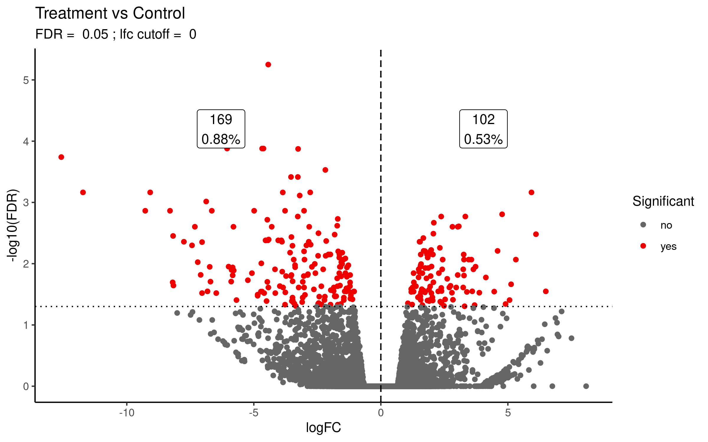

Different significance levels can be used to filter the plotted points. For example,
significance levels can be set by specifying the `fdr` and `lfc` values.

```R
plot_volcano(res_df, fdr = 0.01, lfc = log2(2)) + ggtitle("Treatment vs Control")
```

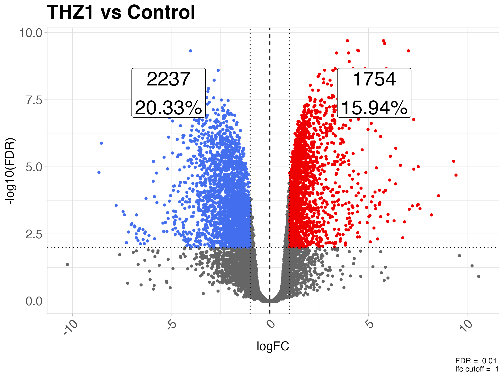

Labels for the counts will be displayed by default. To remove them set `annotate_counts = FALSE`

```R
plot_volcano(res_df, fdr = 0.01, lfc = log2(2), annotate_counts = FALSE) +
  ggtitle("Treatment vs Control")
```


Positions of the count labels can be adjusted by setting the `xmax_label_offset`, `xmin_label_offset` 
and `ymax_label_offset` values. Setting the values closer to 1 moves the labels away from the origin.
`xmax_label_offset` controls the 'up' gene label whereas `xmin_label_offset` controls the 'down'
genes label. `ymax_label_offset` controls the vertical position of the labels.

```R
plot_volcano(res_df,
             fdr = 0.01,
             lfc = log2(2),
             xmax_label_offset = 0.2, 
             xmin_label_offset = 0.7, 
             ymax_label_offset = 0.9)  +
  ggtitle("Treatment vs Control")
```

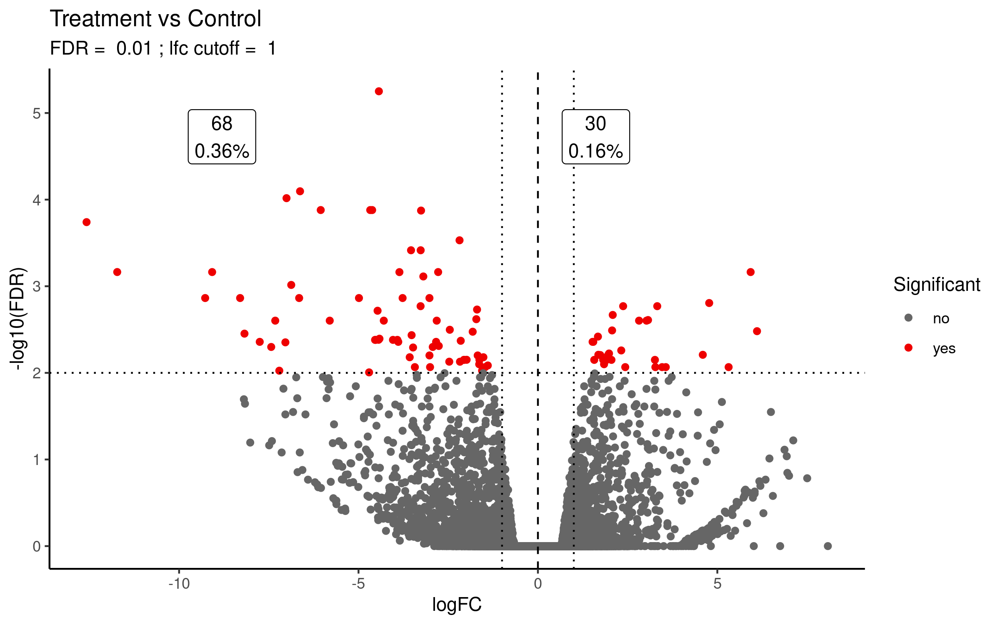

Text labels can also be added for the DE genes by setting `label_sig = TRUE`. Caution, if there are many
DE genes this will be overplotted. By default the function uses the `feature_id`
column created by `edger_to_df()`. If your labels are in a different column then
you must pass the label column to the `lab` argument.

```R
plot_volcano(res_df,
             fdr = 1e-4,
             lfc = log2(2),
             annotate_counts = FALSE,
             label_sig = TRUE)  +
  ggtitle("Treatment vs Control")
```

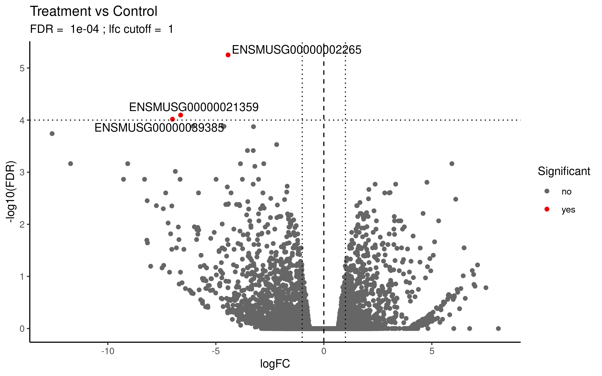

### Create md plot from differential expression results

```R
# For edgeR results default values can be used
plot_md(res_df) + ggtitle("Treatment vs Control")

# For DESeq2 results you must specify the column names
plot_md(deseq_res_df,
        x = "baseMean",
        y = "log2FoldChange",
        sig_col = "padj"
        )
```

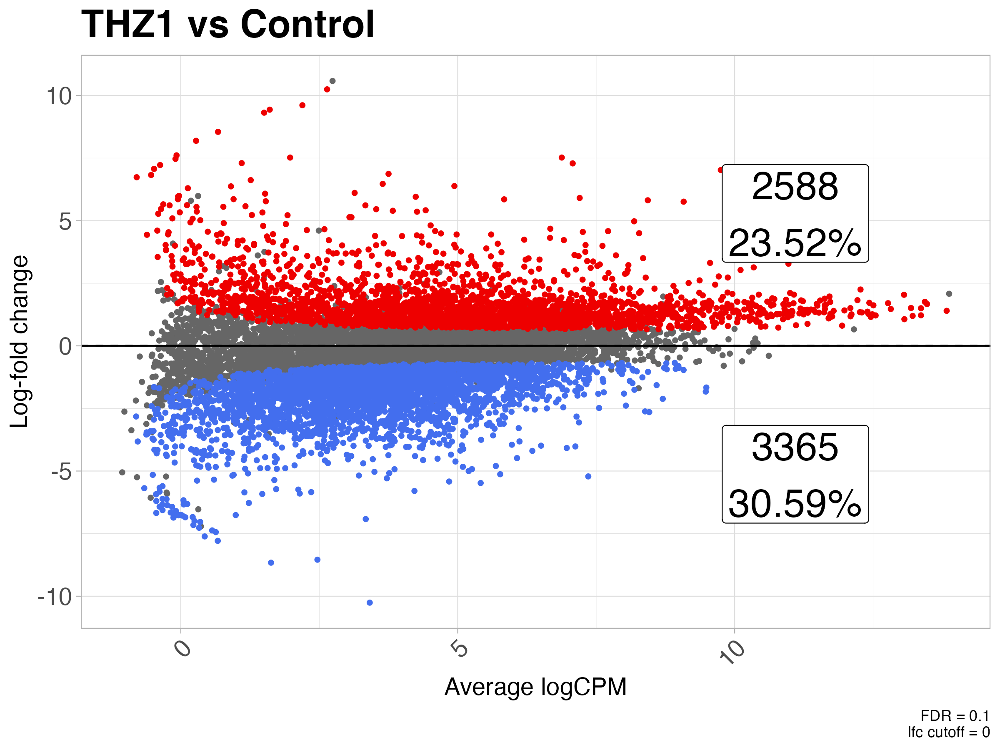

Different significance levels can be used to filter the plotted points. For example,
significance levels can be set by specifying the `fdr` and `lfc` values.

```R
plot_md(res_df, fdr = 0.01, lfc = log2(2)) + ggtitle("Treatment vs Control")
```

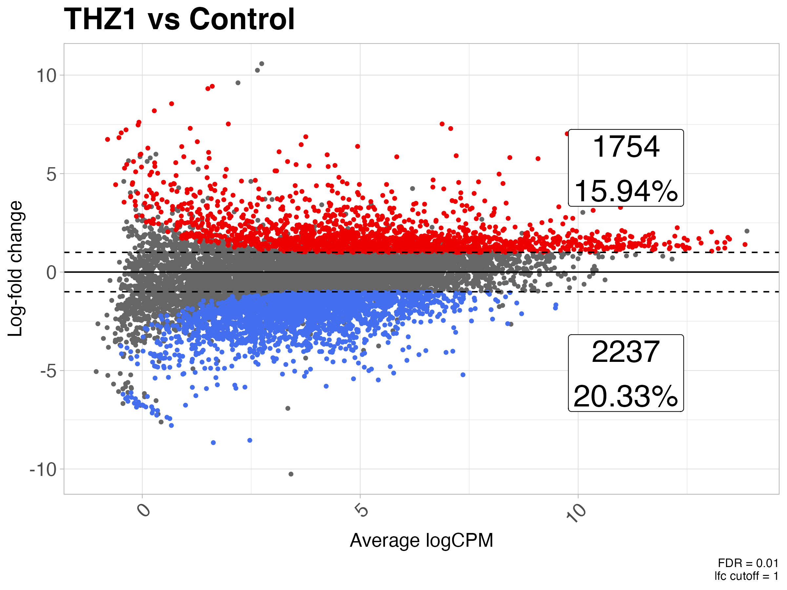

Labels for the counts will be displayed by default. To remove them set `annotate_counts = FALSE`

```R
plot_md(res_df, 
        fdr = 0.01, 
        lfc = log2(2),
        annotate_counts = FALSE) +
  ggtitle("Treatment vs Control")
```

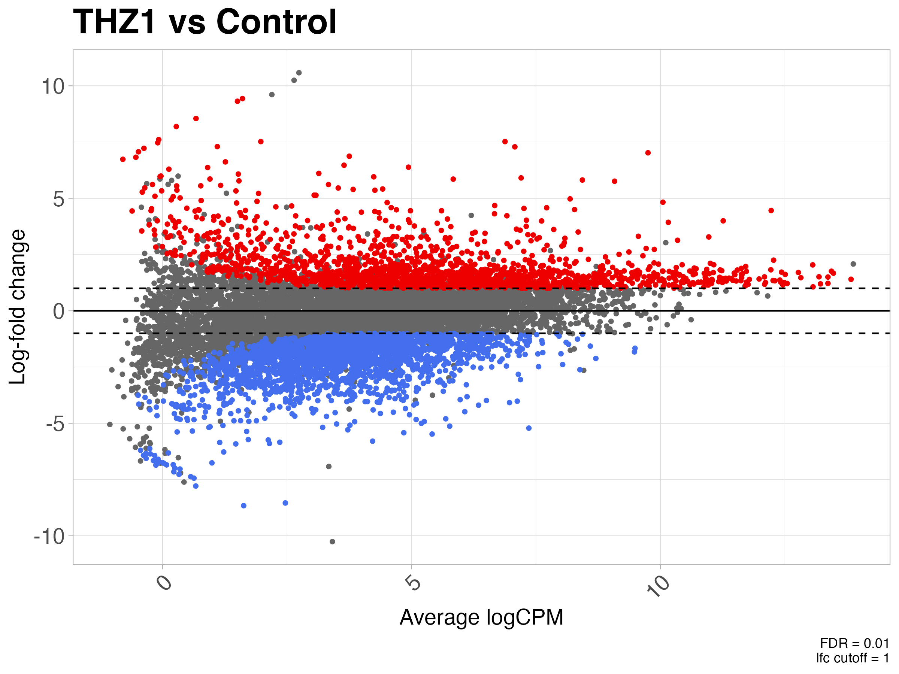

Positions of the count labels can be adjusted by setting the `xmax_label_offset`, `ymin_label_offset` 
and `ymax_label_offset` values. Setting the values closer to 1 moves the labels away from the origin.
`xmax_label_offset` controls the horizontal position of the labels. `ymin_label_offset` controls the 
'down' gene label. `ymax_label_offset` controls the 'up' genes label.

```R
plot_md(res_df, 
        fdr = 0.01,
        lfc = log2(2),
        xmax_label_offset = 0.6, 
        ymin_label_offset = 0.25, 
        ymax_label_offset = 0.25) +
  ggtitle("Treatment vs Control")
```

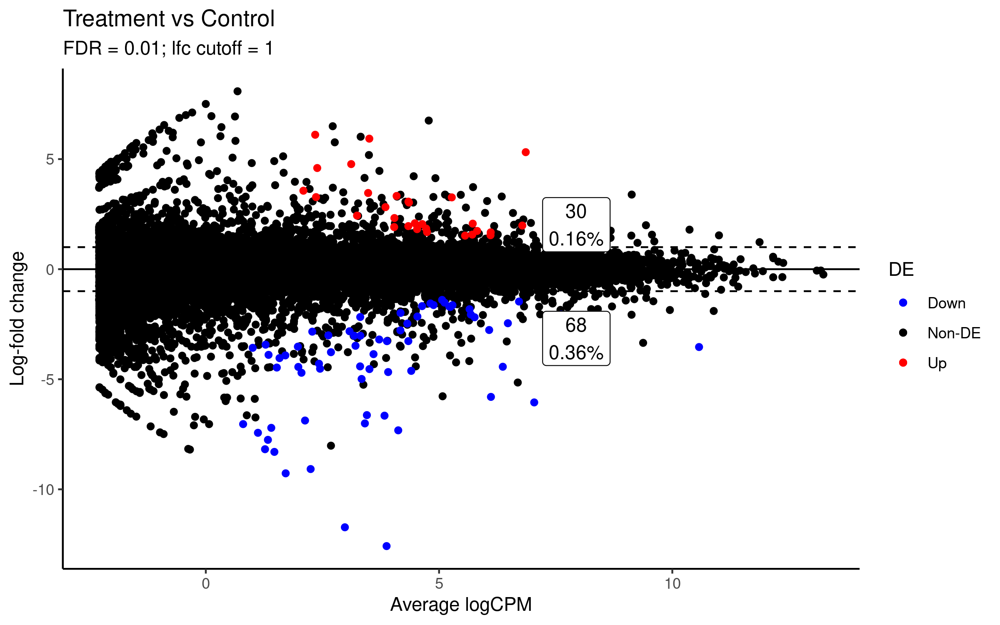

### Heatmap with sensible defaults

We often use the same settings when making calls to `pheatmap`. This function is a wrapper around `pheatmap`
which uses sensible default values for expression data. It changes the default color scale to a diverging
blue to white to red scale, modifies the clustering parameters (row-wise euclidean, col-wise correlation) and
clustering method (complete), angles the column labels, removes border colors and rownames. 

Any of these options can be overridden by simply supplying the arguments to `quickmap` as you would `pheatmap`. 
This also allows for additional arguments to be passed to the `quickmap` function for creating row and column 
annotations. 

```R
# generate some example data and log-scale it
lcpms <- coriell::simulate_counts(n = 1000)$table %>% log1p()

# plot a heatmap of the logCPM values
quickmap(lcpms)
```

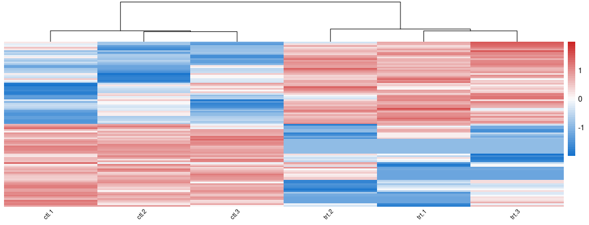

Other `pheatmap` arguments can be passed to the `quickmap` function as well.

```R
# create annotation for columns
col_df <- data.frame(treatment = rep(c("ctl", "trt"), each = 3))
rownames(col_df) <- colnames(lcpms)

# create color scheme for treatment conditions
ann_colors = list(treatment = c("ctl" = "steelblue", "trt" = "firebrick"))

# plot the heatmap, passing additional args to pheatmap
quickmap(lcpms,
         annotation_col = col_df,
         annotation_colors = ann_colors,
         main = "Treatment vs Control")
```

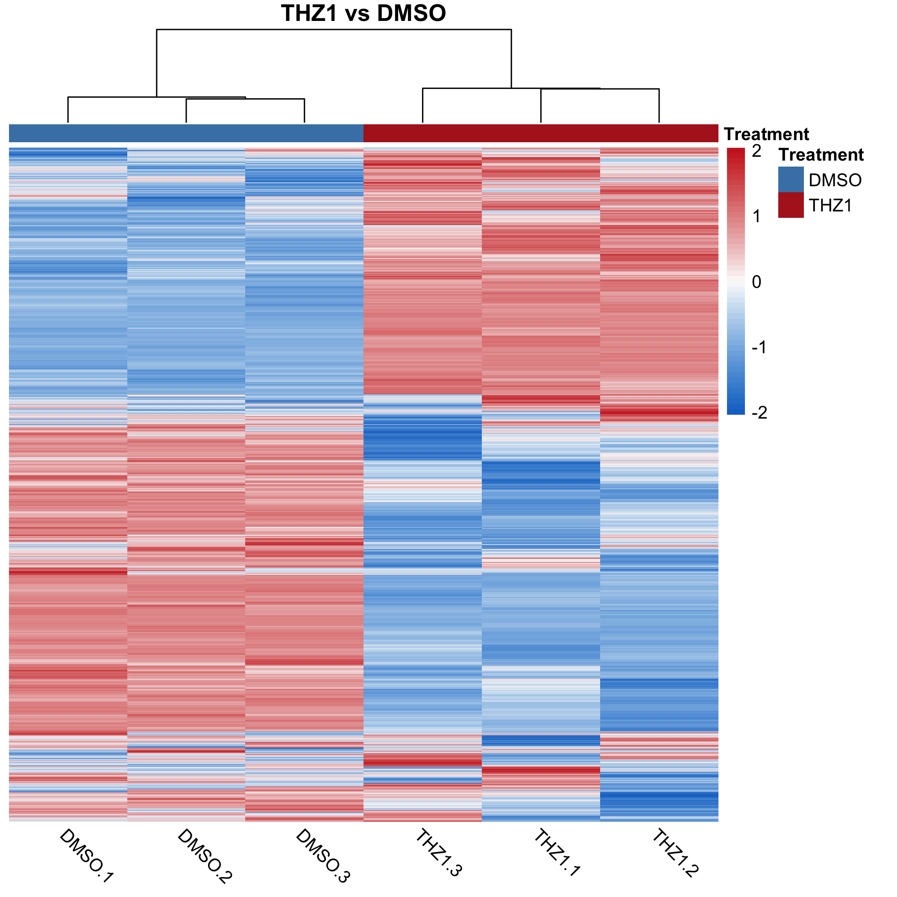

There are two default color scales included which can be specified by setting the `diverging_palette` argument. 
By default `diverging_palette = TRUE` which sets the color scale the same as the above heatmaps. This is useful for
scaled data. However, if you are plotting unscaled data such as normalized expression values then a continuous color
palette is more appropriate. Setting `diverging_palette = FALSE` will set the color palette to a continuous (`viridis::magma(50)`)
palette.

```R
# NOTE: different lcpms data than above
quickmap(lcpms, diverging_palette = FALSE, scale = "none")
```

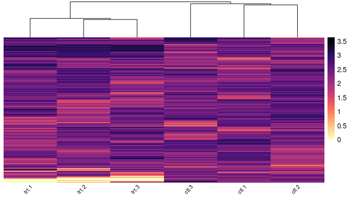

### Z-score a dataframe

Z-score a dataframe by row or column

```R
# create some example data
cpms <- data.frame(a = runif(100, min = 0, max = 100),
                   b = runif(100, min = 0, max = 100),
                   c = runif(100, min = 0, max = 100),
                   d = runif(100, min = 0, max = 100))

> head(cpms)
>           a        b        c         d
> 1 93.586737 41.79316 58.59588 73.082215
> 2 70.009822 25.84383 57.03569 40.512135
> 3 60.053908 14.68176 82.66302 60.842900
> 4 95.711441 86.76281 58.07523 22.571323
> 5  2.833631 25.04612 72.85270  5.417795
> 6 24.596068 85.46398 16.12987 33.810050

# scale the data by rows
cpms_st <- zscore_df(cpms)

> head(cpms_st)
>            a           b          c          d
> 1  1.2201846 -1.13598436 -0.3716029  0.2874026
> 2  1.1247307 -1.16871823  0.4510108 -0.4070232
> 3  0.1922442 -1.39554374  0.9834448  0.2198548
> 4  0.9076295  0.63627273 -0.2336442 -1.3102580
> 5 -0.7309118 -0.04598875  1.4281295 -0.6512290
> 6 -0.4943903  1.45917080 -0.7661138 -0.1986667


# default is to scale by row, scaling by columns can also be performed by
# setting the by = "column"
cpms_st_by_col <- zscore_df(cpms, by = "column")
```

### Convert a list of sets into a binary matrix

This function is useful for comparing if a given gene is present across all
or a certain proportion of conditions.

```R
sets <- list("set1" = letters[1:4],
             "set2" = letters[3:8],
             "set3" = letters[1:5],
             "set4" = letters[4:6])

# convert the sets to a binary matrix
mat <- list_to_matrix(sets)

mat
>   set1 set2 set3 set4
> a    1    0    1    0
> b    1    0    1    0
> c    1    1    1    0
> d    1    1    1    1
> e    0    1    1    1
> f    0    1    0    1
> g    0    1    0    0
> h    0    1    0    0
```

### Get statistics for all pairwise combinations of a list of sets

Compare every set to every other set and return statistics about their intersections.

Statistics are returned in a list object. The returned list contains a named vector of the 
statistic computed. The names of the vectore indicate the pairwise comparison, i.e. "Set A : Set B"
for all combinations of sets. Use `?pairwise_intersection_stats()` for more information about
the statistics computed.

```R
sets <- list("set1" = letters[1:4],
             "set2" = letters[3:8],
             "set3" = letters[1:5],
             "set4" = letters[4:6])

# get the intersection stats -- returns a list of statistics
stats <- pairwise_intersection_stats(sets)

# individual statistics can be accessed with subsetting the list
# to get the intersection sizes of every combination of sets:
stats$intersection_size

> set1 : set2 set1 : set3 set1 : set4 set2 : set3 set2 : set4 set3 : set4 
>           2           4           1           3           3           2
```

### Perform Gene Ontology Analysis with PANTHER

This function sends a request to the PANTHER REST API for GO over-representation
analysis on the user specified vector of genes. The API should accept Ensembl 
gene identifiers, Ensembl protein identifiers, Ensembl transcript identifiers, 
Entrez gene ids, gene symbols, NCBI GIs, HGNC Ids, International protein index ids,
NCBI UniGene ids, UniProt accessions and UniProt ids. The function will return a 
tibble of the GO results for the user specified organism, annotation dataset, 
test type and test correction method.

NOTE: the `organism` parameter is given by the Entrez Taxon ID. Typical values 
for this parameter are "9606" for HUMAN, "10090" for MOUSE, "10116" for RAT. Any
other Taxon ID could also be used. see `?coriell::panther_go` for more information.

```R
genes <- c("CTNNB1", "ADAM17", "AXIN1", "AXIN2", "CCND2", "CSNK1E", "CTNNB1", 
           "CUL1", "DKK1", "DKK4", "DLL1", "DVL2", "FRAT1", "FZD1", "FZD8", 
           "GNAI1", "HDAC11", "HDAC2", "HDAC5", "HEY1", "HEY2", "JAG1", 
           "JAG2", "KAT2A", "LEF1", "MAML1", "MYC", "NCOR2", "NCSTN", 
           "NKD1", "NOTCH1", "NOTCH4", "NUMB", "PPARD", "PSEN2", "PTCH1", 
           "RBPJ", "SKP2", "TCF7", "TP53", "WNT1", "WNT5B", "WNT6")

go_results <- coriell::panther_go(
                                genes, 
                                organism = "9606", 
                                annot_dataset = "biological_process")

head(go_results$table, n = 10)
> result_number number_in_list fold_enrichment      fdr expected number_in_reference   pValue plus_minus GO_term    description                            
> <chr>                  <int>           <dbl>    <dbl>    <dbl>               <int>    <dbl> <chr>      <chr>      <chr>                                  
> 1                         32           6.29  3.63e-17    5.09                 2525 2.28e-21 +          GO:0007166 cell surface receptor signaling pathway
> 2                         24           10.6  5.46e-16    2.27                 1129 6.87e-20 +          GO:0060429 epithelium development                 
> 3                         17           24.3  8.23e-16    0.701                 348 1.55e-19 +          GO:0198738 cell-cell signaling by wnt             
> 4                         17           24.3  6.18e-16    0.701                 348 1.55e-19 +          GO:0016055 Wnt signaling pathway                  
> 5                         34           4.72  9.14e-16    7.20                 3576 2.87e-19 +          GO:0010646 regulation of cell communication       
> 6                         33           5.00  9.16e-16    6.60                 3277 3.46e-19 +          GO:0048513 animal organ development               
> 7                         19           17.0  9.19e-16    1.12                  555 4.04e-19 +          GO:0048729 tissue morphogenesis                   
> 8                         34           4.67  8.11e-16    7.28                 3615 4.08e-19 +          GO:0023051 regulation of signaling                
> 9                         12           70.9  7.58e-16    0.169                  84 4.29e-19 +          GO:0060070 canonical Wnt signaling pathway        
> 10                        13           52.5  7.24e-16    0.248                 123 4.55e-19 +          GO:0007219 Notch signaling pathway


# using ensembl ids ------------------------------------------------------------
# all unique ensembl IDs for the above gene set
ensembl_ids <- c("ENSG00000162736", "ENSG00000143801", "ENSG00000177283", 
                 "ENSG00000107984", "ENSG00000165879", "ENSG00000111186", 
                 "ENSG00000118971", "ENSG00000125084", "ENSG00000196498", 
                 "ENSG00000133961", "ENSG00000103126", "ENSG00000004975", 
                 "ENSG00000141510", "ENSG00000108840", "ENSG00000168646", 
                 "ENSG00000151694", "ENSG00000115596", "ENSG00000101384", 
                 "ENSG00000213923", "ENSG00000163517", "ENSG00000168036", 
                 "ENSG00000138795", "ENSG00000145604", "ENSG00000081059", 
                 "ENSG00000161021", "ENSG00000204301", "ENSG00000112033", 
                 "ENSG00000196591", "ENSG00000135547", "ENSG00000198719", 
                 "ENSG00000127955", "ENSG00000157240", "ENSG00000055130", 
                 "ENSG00000104371", "ENSG00000164683", "ENSG00000136997", 
                 "ENSG00000185920", "ENSG00000148400", "ENSG00000283780", 
                 "ENSG00000275555", "ENSG00000238196", "ENSG00000235396", 
                 "ENSG00000232339", "ENSG00000223355", "ENSG00000206312", 
                 "ENSG00000234876")

ensembl_results <- panther_go(ensembl_ids, "9606", "biological_process")

head(ensembl_results$table, n = 10)
> result_number number_in_list fold_enrichment      fdr expected number_in_reference   pValue plus_minus GO_term   description                                               
> <chr>                  <int>           <dbl>    <dbl>    <dbl>               <int>    <dbl> <chr>      <chr>     <chr>                                                     
> 1                         12           78.4  1.70e-15    0.153                  84 1.07e-19 +          GO:00600… canonical Wnt signaling pathway                           
> 2                         29           6.30  1.25e-15    4.60                 2525 1.57e-19 +          GO:00071… cell surface receptor signaling pathway                   
> 3                         16           25.2  4.33e-15    0.634                 348 8.17e-19 +          GO:01987… cell-cell signaling by wnt                                
> 4                         16           25.2  3.25e-15    0.634                 348 8.17e-19 +          GO:00160… Wnt signaling pathway                                     
> 5                         16           20.9  4.76e-14    0.767                 421 1.50e-17 +          GO:19051… cell surface receptor signaling pathway involved in cell-…
> 6                         21           10.2  9.38e-14    2.06                 1129 3.54e-17 +          GO:00604… epithelium development                                    
> 7                         29           5.01  1.92e-13    5.78                 3174 8.46e-17 +          GO:00099… regulation of signal transduction                         
> 8                         30           4.60  2.68e-13    6.52                 3576 1.35e-16 +          GO:00106… regulation of cell communication                          
> 9                         30           4.55  3.23e-13    6.59                 3615 1.83e-16 +          GO:00230… regulation of signaling                                   
> 10                        29           4.86  3.22e-13    5.97                 3277 2.02e-16 +          GO:00485… animal organ development 

# using mouse genes ------------------------------------------------------------
mouse_genes <- c("Adam17", "Axin1", "Axin2", "Ccnd2", "Csnk1e", "Ctnnb1", 
                 "Cul1", "Dkk1", "Dkk4", "Dll1", "Dvl2", "Frat1", "Fzd1", 
                 "Fzd8", "Gnai1", "Hdac11", "Hdac2", "Hdac5", "Hey1", "Hey2", 
                 "Jag1", "Lef1", "Maml1", "Myc", "Ncor2", "Ncstn", "Notch1", 
                 "Notch4", "Numb", "Ppard", "Psen2", "Ptch1", "Skp2", "Tcf7", 
                 "Wnt1", "Wnt5b", "Wnt6")

mouse_results <- panther_go(
                            mouse_genes, 
                            organism = "10090", 
                            annot_dataset = "biological_process")

head(mouse_results$table, n = 10)
> result_number number_in_list fold_enrichment      fdr expected number_in_reference   pValue plus_minus GO_term    description                                                     
> <chr>                  <int>           <dbl>    <dbl>    <dbl>               <int>    <dbl> <chr>      <chr>      <chr>                                                           
> 1                         13           97.8  2.50e-18    0.133                  80 1.58e-22 +          GO:0060070 canonical Wnt signaling pathway                                 
> 2                         16           40.5  4.10e-18    0.396                 238 5.18e-22 +          GO:0198738 cell-cell signaling by wnt                                      
> 3                         16           40.5  2.73e-18    0.396                 238 5.18e-22 +          GO:0016055 Wnt signaling pathway                                           
> 4                         23           13.3  3.77e-18    1.72                 1037 9.53e-22 +          GO:0060429 epithelium development                                          
> 5                         27           8.52  8.41e-18    3.17                 1907 2.66e-21 +          GO:0007166 cell surface receptor signaling pathway                         
> 6                         16           33.0  3.10e-17    0.485                 292 1.18e-20 +          GO:1905114 cell surface receptor signaling pathway involved in cell-cell s…
> 7                         25           9.04  1.39e-16    2.77                 1664 6.17e-20 +          GO:0009888 tissue development                                              
> 8                         27           7.21  3.95e-16    3.75                 2254 2.00e-19 +          GO:0009653 anatomical structure morphogenesis                              
> 9                         29           6.06  4.50e-16    4.78                 2878 2.56e-19 +          GO:0009966 regulation of signal transduction                               
> 10                        21           12.3  1.04e-15    1.71                 1026 6.57e-19 +          GO:0009887 animal organ morphogenesis 
```

### Subsample a count matrix

Sub-sample a count matrix so that all columns have a library size equivalent
to the smallest library in the input matrix.

```{r}
library(coriell)


# simulate a count matrix
mat <- simulate_counts()$table

# scale the counts so that the libraries are different sizes
offset <- c(0.5, 0.75, 1.0, 1.25, 1.5, 1.75)
scaled <- round(mat %*% diag(offset))
dimnames(scaled) <- dimnames(mat)

colSums(scaled)
> ctl.1 ctl.2 ctl.3 trt.1 trt.2 trt.3 
>  4966  7586  9961 12745 15260 17805

# Subsample the matrix to the smallest library size
ss <- subsample_counts(scaled)

colSums(ss)
> ctl.1 ctl.2 ctl.3 trt.1 trt.2 trt.3 
>  4966  4966  4966  4966  4966  4966
```
