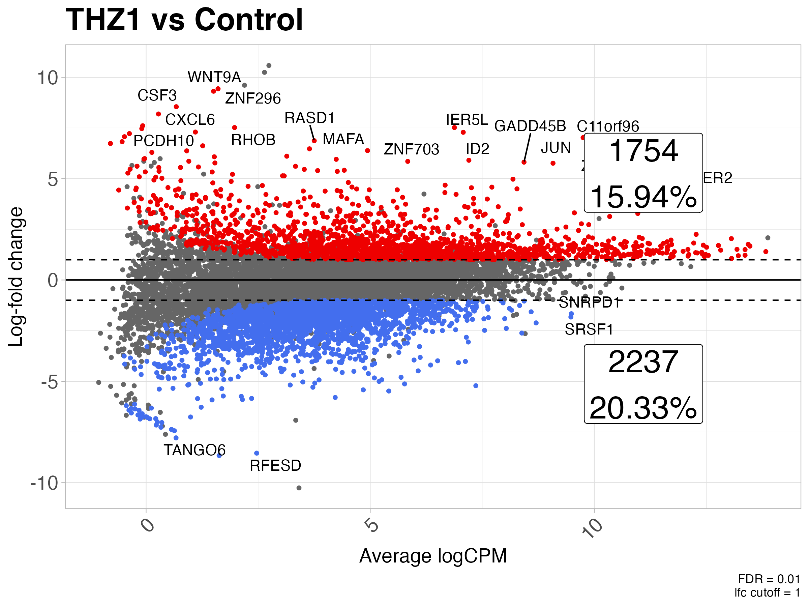
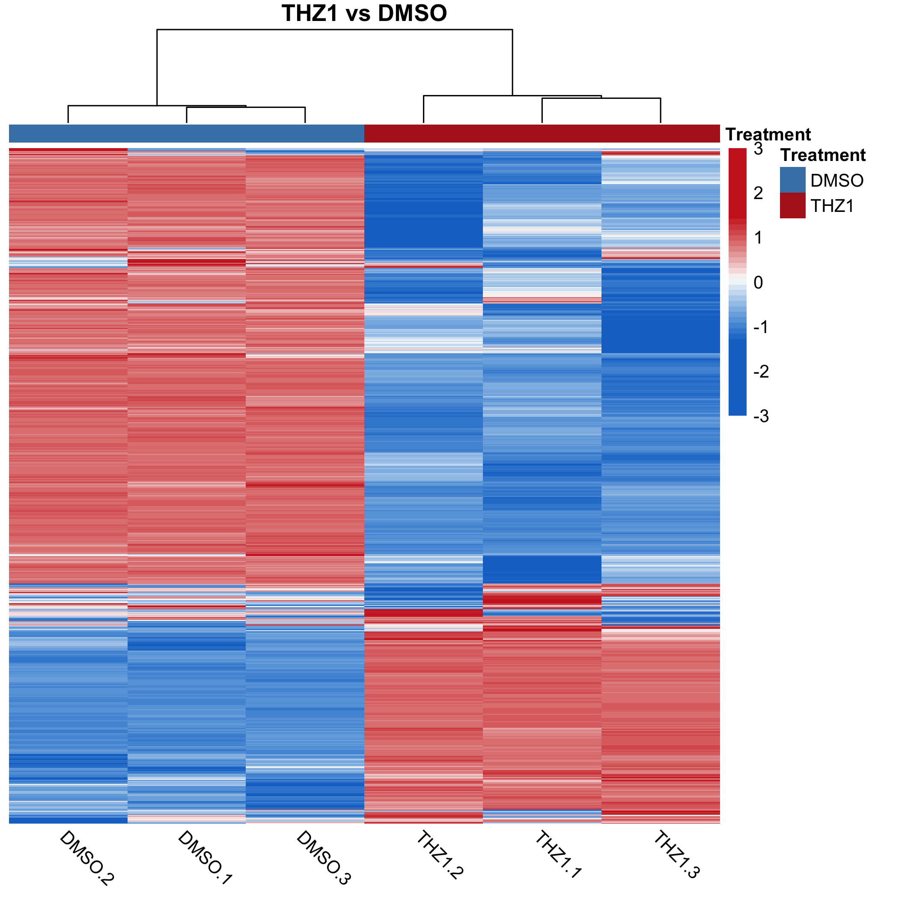
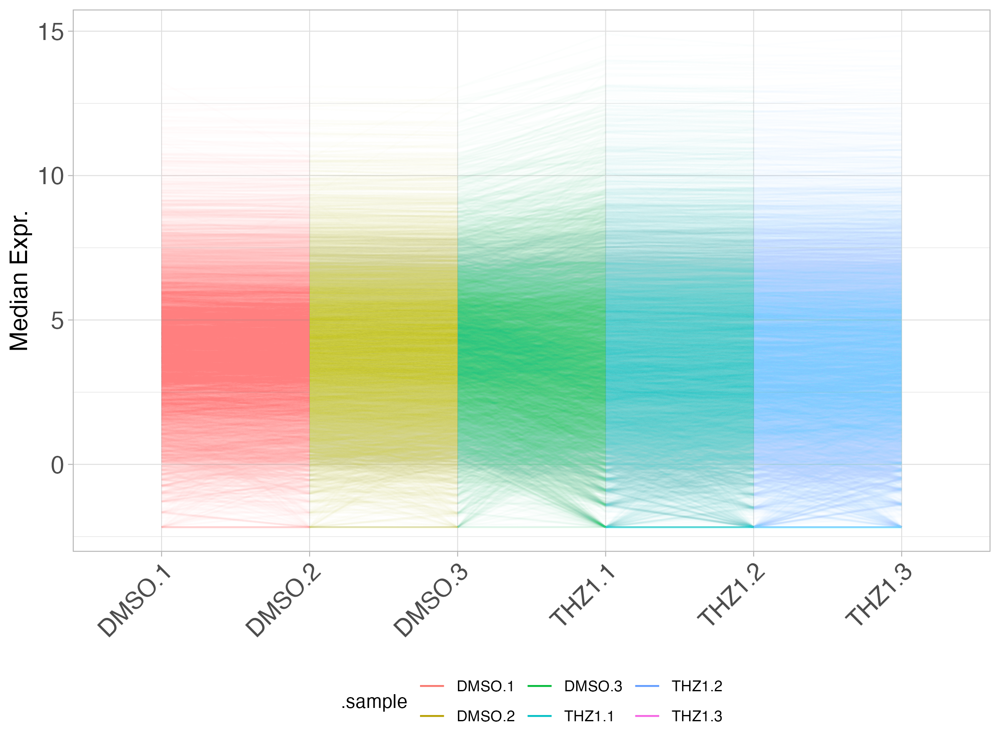
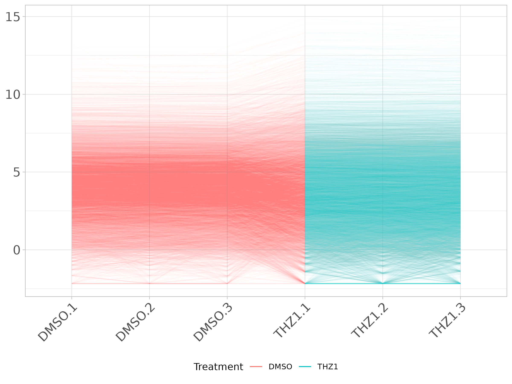
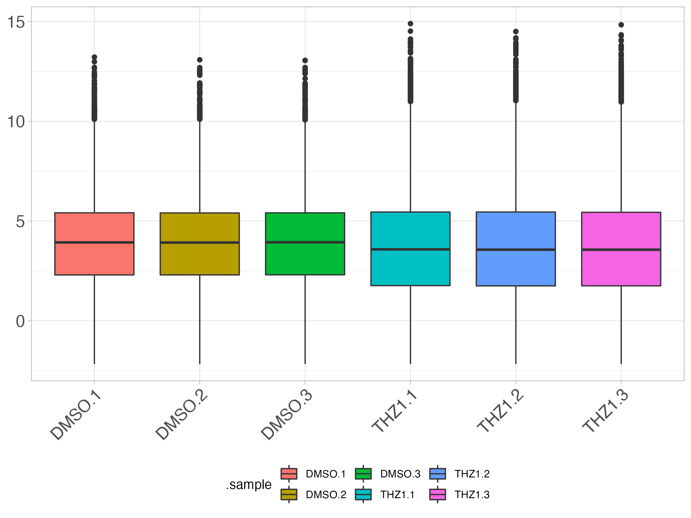
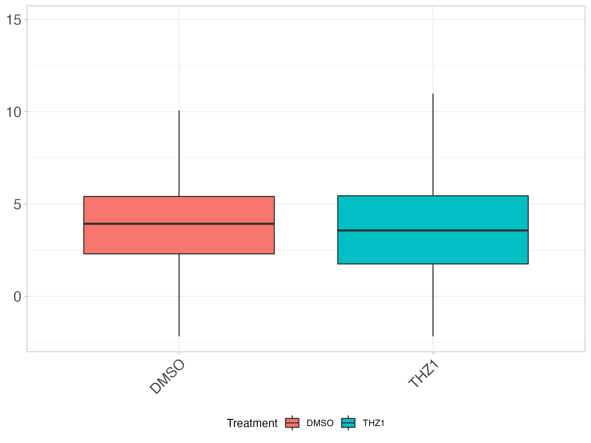
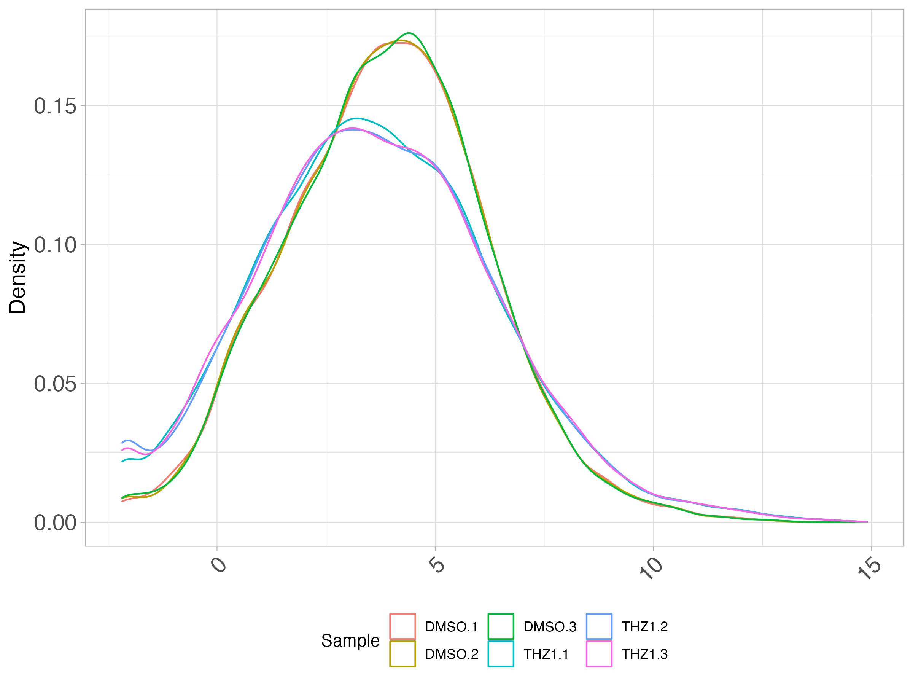
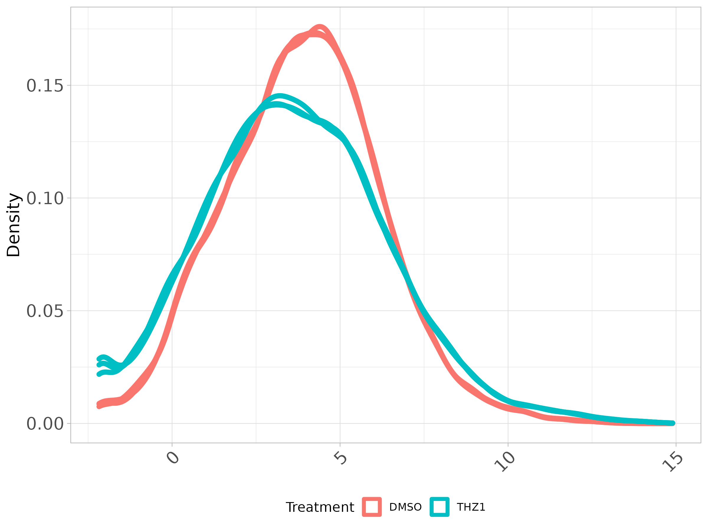

# coriell

This package contains helper functions for common bioinformatics tasks (and some 
not-so-common tasks). If you find yourself reusing old code over and over, let 
me know and we'll create a function and put it in this package. 

## Installation

The latest version can be installed from Github using:

```R
if (!require("devtools")) {
  install.packages("devtools")
}
devtools::install_github("coriell-research/coriell")
```

## Examples

- [Summarize results from differential expression analysis](https://coriell-research.github.io/coriell/#summarize-results-from-differential-expression-test)
- [Create volcano plot from differential expression results](https://coriell-research.github.io/coriell/#create-volcano-plot-from-differential-expression-results)
- [Create md plot from differential expression results](https://coriell-research.github.io/coriell/#create-md-plot-from-differential-expression-results)
- [Heatmap with sensible defaults](https://coriell-research.github.io/coriell/#heatmap-with-sensible-defaults)
- [Parallel coordinates plot of expression matrix](https://coriell-research.github.io/coriell/#parallel-coordinates-plot-of-expression-matrix)
- [Boxplot of expression matrix](https://coriell-research.github.io/coriell/#boxplot-of-expression-matrix)
- [Density plot of expression matrix](https://coriell-research.github.io/coriell/#density-plot-of-expression-matrix)

The package also contains many other convenience functions so be sure to check 
out the [reference](https://coriell-research.github.io/coriell/reference/index.html) 
page and articles as well.

### Built-in datasets

These datasets are built into the package for testing purposes and are used 
below to illustrate some functionality.

* `GSE161650_de` : Differential expression results of THZ1 vs DMSO from GSE161650 
* `GSE161650_lc` : Normalized log2 counts from THZ1 vs DMSO replicates from GSE161650 

The head of `GSE161650_de` looks like:

```
>   feature_id     logFC unshrunk.logFC    logCPM       PValue          FDR
> 1        JUN  5.759233       5.759908  9.079350 2.919097e-14 1.990666e-10
> 2       IER5  3.931325       3.931420 10.158336 3.365738e-14 1.990666e-10
> 3    GADD45B  5.813030       5.814071  8.432432 6.435666e-14 2.537583e-10
> 4       IER2  4.457981       4.458016 12.223835 1.528890e-13 4.521309e-10
> 5     PIK3R3 -4.018325      -4.019603  7.124408 2.122484e-13 4.752097e-10
> 6     HEXIM1  4.497345       4.497844  8.275561 2.696985e-13 4.752097e-10
```

And `GSE161650_lc`:

```
>          DMSO.1     DMSO.2     DMSO.3    THZ1.1    THZ1.2     THZ1.3
> A1BG  5.3323512  5.4576081  5.2876011  6.703752 6.8090471  6.7908595
> AAAS  3.8738768  3.8839857  3.5242625  3.768811 4.1406003  3.7454773
> AACS  2.1381539  2.3748462  2.2761971  3.769163 3.4352003  3.4064114
> AADAT 0.8240013 -0.2391457 -0.8699138 -1.342273 0.1967574 -0.8355924
> AAED1 1.2814586  1.5332476  2.0735095  2.443188 2.1270932  0.9707206
> AAGAB 6.8747238  6.7396922  6.6670762  6.756664 6.5840839  6.7662317
```

See the package documentation `?GSE161650_de` and `?GSE161650_lc` for 
citation information.

### Summarize results from differential expression test

Return a table of up/down/non-de counts and their percentages.

```R
de <- GSE161650_de

summarize_dge(de, fdr = 0.1)
>     Direction    N Percent
> 1          Up 2588   23.52
> 2        Down 3365   30.59
> 3 Unperturbed 5049   45.89
```

### Create volcano plot from differential expression results

```R
library(ggplot2)

plot_volcano(de) + 
  ggtitle("THZ1 vs Control") + 
  theme_coriell()
```


Different significance levels can be used to filter the plotted points. For example,
significance levels can be set by specifying the `fdr` and `lfc` values.

```R
plot_volcano(de, fdr = 0.01, lfc = log2(2)) + 
  ggtitle("THZ1 vs Control") + 
  theme_coriell()
```


Labels for the counts will be displayed by default. To remove them set `annotate_counts = FALSE`

```R
plot_volcano(de, fdr = 0.01, lfc = log2(2), annotate_counts = FALSE) + 
  ggtitle("THZ1 vs Control") + 
  theme_coriell()
```


Text labels can also be added for the DE genes by setting `label_sig = TRUE`. 
If `label_sig = TRUE` then the `lab` argument must also designate a column 
containing the names of the items to plot. Additional arguments can be passed 
to `ggrepel::geom_text_repel()` via `...` if you need to modify the behavior 
of the labels.

```R
plot_volcano(de, fdr = 0.01, lfc = log2(2), label_sig = TRUE, lab = "feature_id") + 
  ggtitle("THZ1 vs Control") + 
  theme_coriell()
```


All aesthetics of the points can also be changed

```R
plot_volcano(de,
  fdr = 0.01, 
  lfc = log2(2),
  up_color = "firebrick",
  down_color = "midnightblue",
  nonde_color = "grey80",
  up_alpha = 0.8,
  down_alpha = 0.8,
  nonde_alpha = 0.25,
  up_size = 0.5,
  down_size = 0.5,
  nonde_size = 0.5
  ) + 
  ggtitle("THZ1 vs Control") + 
  theme_coriell()
```


### Create md plot from differential expression results

```R
plot_md(de) + 
  ggtitle("THZ1 vs Control") + 
  theme_coriell()
```


Different significance levels can be used to filter the plotted points. For example,
significance levels can be set by specifying the `fdr` and `lfc` values.

```R
plot_md(de, fdr = 0.01, lfc = log2(2)) + 
  ggtitle("THZ1 vs Control") + 
  theme_coriell()
```


Labels for the counts will be displayed by default. To remove them set `annotate_counts = FALSE`

```R
plot_md(de, fdr = 0.01, lfc = log2(2), annotate_counts = FALSE) + 
  ggtitle("THZ1 vs Control") + 
  theme_coriell()
```


Text labels can also be added for the DE genes by setting `label_sig = TRUE`. 
If `label_sig = TRUE` then the `lab` argument must also designate a column 
containing the names of the items to plot. Additional arguments can be passed 
to `ggrepel::geom_text_repel()` via `...` if you need to modify the behavior 
of the labels.

```R
plot_md(de, fdr = 0.01, lfc = log2(2), label_sig = TRUE, lab = "feature_id") + 
  ggtitle("THZ1 vs Control") + 
  theme_coriell()
```



All aesthetics of the points can also be changed

```R
plot_md(de,
  fdr = 0.01, 
  lfc = log2(2),
  up_color = "firebrick",
  down_color = "midnightblue",
  nonde_color = "grey80",
  up_alpha = 0.8,
  down_alpha = 0.8,
  nonde_alpha = 0.25,
  up_size = 0.5,
  down_size = 0.5,
  nonde_size = 0.5
  ) + 
  ggtitle("THZ1 vs Control") + 
  theme_coriell()
```


### Heatmap with sensible defaults

We often use the same settings when making calls to `pheatmap`. This function 
is a wrapper around `pheatmap` which uses sensible default values for expression 
data.

Any of these default values can be overridden by simply supplying the arguments 
to `quickmap` as you would `pheatmap`. This also allows for additional arguments 
to be passed to the `quickmap` function for creating row and column annotations. 

```R
logcounts <- GSE161650_lc

# plot a heatmap of the logCPM values
quickmap(logcounts)
```


Other `pheatmap` arguments can be passed to the `quickmap` function as well.

```R
# create annotation for columns
col_df <- data.frame(Treatment = rep(c("DMSO", "THZ1"), each = 3))
rownames(col_df) <- colnames(logcounts)

# create color scheme for treatment conditions
ann_colors = list(Treatment = c("DMSO" = "steelblue", "THZ1" = "firebrick"))

# plot the heatmap, passing additional args to pheatmap
quickmap(
  logcounts,
  annotation_col = col_df,
  annotation_colors = ann_colors,
  main = "Treatment vs Control"
  )
```


Additional arguments can be set to limit the scales of the heatmap as well as
remove low variance features prior to plotting. To remove low variance features
set the `removeVar` argument to the desired proportion of features to drop.

```R
quickmap(
  logcounts,
  removeVar = 0.9,
  annotation_col = col_df,
  annotation_colors = ann_colors,
  main = "THZ1 vs DMSO"
)
```


The colors of the heatmap scale can also be 'fixed' above and below a certain 
threshold with the `fix_extreme` and `thresh` arguments

```R
quickmap(
    logcounts,
    removeVar = 0.9,
    fix_extreme = TRUE,
    thresh = 0.5,
    annotation_col = col_df,
    annotation_colors = ann_colors,
    main = "THZ1 vs DMSO"
)
```



### Parallel coordinates plot of expression matrix

Parallel coordinates plots (PCP), as well as boxplots and density plots (below), 
can be useful tools for examining expression patterns across samples before and 
after normalization, for example. To create a PCP with `coriell` use the 
`plot_parallel()` function. 

Using `logcounts` define above:

```R
# Create PCP plot -- passing additional alpha value to geom_line()
plot_parallel(logcounts, alpha = 0.01) + theme_coriell()
```



If metadata is supplied then the PCP can be colored by the supplied variable 
name. Using `col_df` defined above:

```R
plot_parallel(logcounts, col_df, colBy = "Treatment", alpha = 0.01) + 
  theme_coriell()
```



### Boxplot of expression matrix

Likewise, boxplots of the expression values can be visualized in a similar 
fashion with `plot_boxplot()`

```R
plot_boxplot(logcounts) + theme_coriell()
```


If metadata are supplied the boxes can be colored by the desired metadata column
and additional arguments can be passed to `geom_boxplot()` to modify the boxplots.

```R
plot_boxplot(logcounts, col_df, fillBy = "Treatment", outlier.shape = NA) + 
  theme_coriell()
```


### Density plot of expression matrix

Density plots showing the expression values for samples or groups can be plotted
using the `plot_density()` function. 

```R
plot_density(logcounts) + theme_coriell()
```


If metadata are supplied, the lines can be colored by the desired metadata column
and additional arguments can be passed to `geom_density()` to modify the density
layer.

```R
plot_density(logcounts, col_df, colBy = "Treatment", size = 2) + 
  theme_coriell()
```

