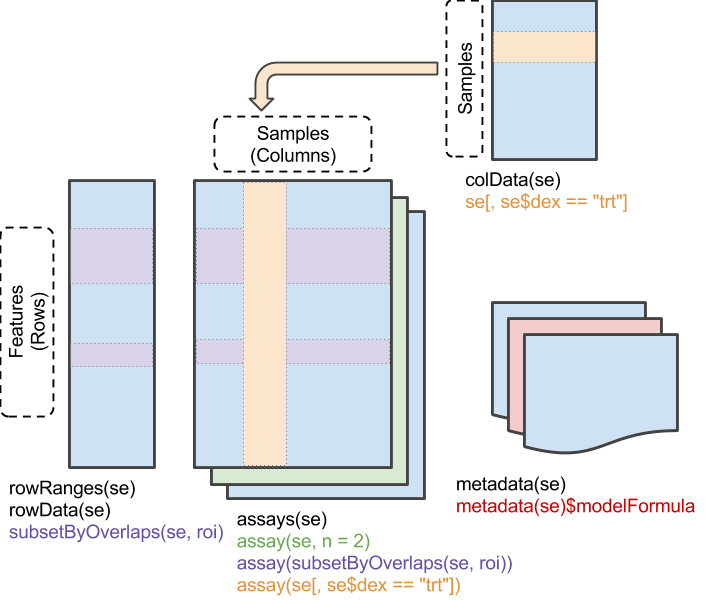

```{r, include = FALSE}
knitr::opts_chunk$set(
  collapse = TRUE,
  comment = "#>"
)
```

## What are `SummarizedExperiments`

`SummarizedExperiments` are R objects meant for organizing and manipulating
rectangular matrices that are typically produced by arrays or high-throughput 
sequencing. If you are doing any kind of analysis that requires associating 
feature-level data (RNA-seq gene counts, methylation array loci, ATAC-seq 
regions, etc.) with the genomic coordinates of those features and the 
sample-level metadata with which those features were measured, then you should 
be using a `SummarizedExperiment` to organize, manipulate, and store your 
results. 

Please take a moment to read through the first 2 sections (at least) of the 
[SummarizedExperiment vignette](https://bioconductor.org/packages/release/bioc/vignettes/SummarizedExperiment/inst/doc/SummarizedExperiment.html) in order to familiarize yourself with what 
`SummarizedExperiments` are and their structure. I will demonstrate *how* you 
can use `SummarizedExperiments` below.

## Subsetting in R

`SummarizedExperiments` allow you to quickly and effectively subset your data in
a synchronized fashion that keeps all sample-level metadata, feature-level 
matrix data, and genomic range-level data consistent. The principles of 
`SummarizedExperiments` are derived from base R subsetting operations. Therefore,
in order to become comfortable with `SummarizedExperiments` you should be 
comfortable with some base R functions.

You may have only ever encountered R from the perspective of the 
[tidyverse](https://www.tidyverse.org/). `tidyverse` functions provide useful 
abstractions for munging [tidy data](https://vita.had.co.nz/papers/tidy-data.html)
however, most genomics data is often best represented and operated on as 
matrices. Keeping your data in matrix format can provide many benefits as far 
as speed and code clarity, which in turn helps to ensure correctness. You can 
think of matrices as just fancy 2D versions of vectors. So what are vectors?

Vectors are the main building blocks of most R analyses. Whenever you use the
`c()` function, like: `x <- c('a', 'b', 'c')` you're creating a vector. You can 
do all kinds of cool things with vectors which will prove useful when working 
with `SummarizedExperiments`.

NOTE: the following is heavily inspired by Norm Matloff's excellent 
[fasteR](https://github.com/matloff/fasteR) tutorial. Take a look there to get a 
brief and concise overview base R. You should also check out the first few 
chapters of Hadley Wickham's amazing book [Advanced R](https://adv-r.hadley.nz/).
The [first edition](http://adv-r.had.co.nz/) contains some more information on
base R.

### Subsetting vectors

Below, we'll use the built-in R constant called `LETTERS`. The `LETTERS` 
vector is simply a 'list' of all uppercase letters in the Roman alphabet.

```{r}
LETTERS
```

We can subset the vector by position. For example, to get the 3rd letter we use
the `[` operator and the position we want to extract.

```{r}
LETTERS[3]
```

We can also use a range of positions.

```{r}
LETTERS[3:7]
```

We don't have to select sequential elements either. We can extract elements by
using another vector of positions.

```{r}
LETTERS[c(7, 5, 14, 14, 1, 18, 15)]
```

Vectors become really powerful when we start combining them with logical 
operations.

```{r}
my_favorite_letters <- c("A", "B", "C")

# See that this produces a logical vector of (TRUE/FALSE) values 
# TRUE when LETTERS is one of my_favorite_letters and FALSE otherwise
LETTERS %in% my_favorite_letters

# We can use that same expression to filter the vector
LETTERS[LETTERS %in% my_favorite_letters]
```

This same kind of subsetting works on vectors that contain numeric data as well. 
For example, we can filter the measurements of annual flow of water through the 
Nile river like so:

*Nile is another built-in dataset*

```{r}
# Any values strictly greater than 1200
Nile[Nile > 1200]

# Any even number
Nile[Nile %% 2 == 0]
```

### Subsetting data.frames

But these are just one dimensional vectors. In R we usually deal with 
data.frames (tibbles for you tidyers) and matrices. Lucky for us, the 
subsetting operations we learned for vectors work the same way for data.frames
and matrices.

Let's take a look at the built-in `ToothGrowth` dataset. The data consists of 
the length of odontoblasts in 60 guinea pigs receiving one of three levels of 
vitamin C by one of two delivery methods.

```{r}
head(ToothGrowth)
```

The dollar sign `$` is used to extract an individual column from the data.frame, 
which is just a vector.

```{r}
head(ToothGrowth$len)
```

We can also use the `[[` to get the same thing. Double-brackets come in handy 
when your columns are not valid R names since `$` only works when columns are 
valid names

```{r}
head(ToothGrowth[["len"]])
```

When subsetting a data.frame in base R the general scheme is:

```
df[the rows you want, the columns you want]
```

So in order to get the 5th row of the first column we could do:

```{r}
ToothGrowth[5, 1]
```

Again, we can combine this kind of thinking to extract rows and columns matching
logical conditions. For example, if we want to get all of the animals 
administered orange juice ('OJ')

```{r}
ToothGrowth[ToothGrowth$supp == "OJ", ]
```

We can also combine logical statements. For example, to get all of the rows for 
animals administered orange juice and with odontoblast length ('len') less than 
10.

```{r}
ToothGrowth[ToothGrowth$supp == "OJ" & ToothGrowth$len < 10, ]

# We can also use the bracket notation to select rows and columns at the same time
ToothGrowth[ToothGrowth$supp == "OJ" & ToothGrowth$len < 10, c("len", "supp")]
```

It gets annoying typing `ToothGrowth` every time we want to subset the data.frame. 
Base R has a very useful function called `subset()` that can help us type less.
`subset()` essentially 'looks inside' the data.frame that you give it for the 
given columns and evaluates the expression without having to explicitly tell R
where to find the columns. Think of it like `dplyr::filter()`. 

```{r}
subset(ToothGrowth, supp == "OJ" & len < 10)
```

### Subsetting matrices

Matrices behave much like data.frames but unlike data.frames matrices can only
contain one type of data. This might sound like a limitation at first but 
you'll soon come to realize that matrices are very powerful (and fast) to work 
with in R.

```{r}
set.seed(123)

# Create some random data that looks like methylation values
(m <- matrix(
  data = runif(6 * 10), 
  ncol = 6, 
  dimnames = list(paste0("CpG.", 1:10), 
                  paste0("Sample", 1:6))
  ))
```

If we want to extract the value for CpG.3 for Sample3

```{r}
m[3, 3]
```

Or all values of CpG.3 for every sample

```{r}
m[3, ]

# Or refer to the row by it's name
m["CpG.3", ]
```

Or all CpGs for Sample3

```{r}
m[, 3]

# Or refer to the column by it's name
m[, "Sample3"]
```

We can also apply a mask to the entire matrix at once. For example, the 
following will mark any value that is greater than 0.5 with `TRUE`

```{r}
m > 0.5
```

We can use this kind of masking to filter rows of the matrix using some very 
helpful base R functions that operate on matrices. For example, to get only 
those CpGs where 3 or more samples have a value > 0.5 we can use the `rowSums()`
like so:

```{r}
m[rowSums(m > 0.5) > 3, ]
```

This pattern is very common when dealing with sequencing data. Base R functions
like `rowSums()` and `colMeans()` are specialized to operate over matrices 
and are the most efficient way to summarize matrix data. The R package 
[matrixStats](https://github.com/HenrikBengtsson/matrixStats) also contains 
highly optimized functions for operating on matrices.

Compare the above to the `tidy` solution given the same matrix.

```{r}
tidyr::as_tibble(m, rownames = "CpG") |>
  tidyr::pivot_longer(!CpG, names_to = "SampleName", values_to = "beta") |> 
  dplyr::group_by(CpG) |> 
  dplyr::mutate(n = sum(beta > 0.5)) |> 
  dplyr::filter(n > 3) |>
  tidyr::pivot_wider(id_cols = CpG, names_from = "SampleName", values_from = "beta") |> 
  tibble::column_to_rownames(var = "CpG") |> 
  data.matrix()
```

Hopefully these examples are enough to get you started understanding how 
subsetting works in R and appreciate how useful it is. Now that you have some 
familiarity with the using R functions for subsetting objects, you're ready to
start working with `SummarizedExperiments`. 

## The `SummarizedExperiment`

From the `SummarizedExperiment` [vignette](https://bioconductor.org/packages/release/bioc/vignettes/SummarizedExperiment/inst/doc/SummarizedExperiment.html):



The `SummarizedExperiment` object coordinates four main parts:

- `assay()`, `assays()`: A matrix-like or list of matrix-like objects of identical dimension
  - matrix-like: implements `dim()`, `dimnames()`, and 2-dimensional `[`, `[<-` methods.
  - rows: genes, genomic coordinates, etc.
  - columns: samples, cells, etc.
- `colData()`: Annotations on each column, as a DataFrame.
  - E.g., description of each sample
- `rowData()` and / or `rowRanges()`: Annotations on each row.
  - `rowRanges()`: coordinates of gene / exons in transcripts / etc.
  - `rowData()`: P-values and log-fold change of each gene after differential expresssion analysis.
- `metadata()`: List of unstructured metadata describing the overall content of the object.

In order to better understand how they work, let's construct a 
`SummarizedExperiment` from scratch.

### Constructing a `SummarizedExperiment`

Hopefully you'll already be working with data that is in a `SummarizedExperiment` 
or some other class that derives from one. But just in case you don't have data
structured as a `SummarizedExperiment` it's useful and instructive to 
understand how to create one from scratch.

To be most useful, a `SummarizedExperiment` should have at least:

- A matrix of data with features in rows and samples in columns
- A metadata data.frame with samples as rownames and columns describing their 
properties

Another really useful object to add to `SummarizedExperiments` is a GRanges 
object describing the genomic locations of each feature in the matrix. Adding 
this to the `SummarizedExperiment` creates what is called a 
`RangedSummarizedExperiment` that acts just like a regular `SummarizedExperiment`
with some extra features.

To construct our basic `SummarizedExperiment`:

- We'll create a 'counts' matrix with gene IDs as rows and Samples in columns
- We'll add some metadata describing the Samples
- We'll add on `GRanges()` describing the genomic location of the genes

#### Construct the counts matrix

```{r}
suppressPackageStartupMessages(library(SummarizedExperiment))


counts <- matrix(
  data = rnbinom(n = 200 * 6, mu = 100, size = 1 / 0.5), 
  nrow = 200, 
  dimnames = list(paste0("Gene", 1:200), paste0("Sample", 1:6))
  )

# Take a peak at what this looks like
counts[1:5, 1:5]
```

#### Construct the sample metadata

It is important that the sample metadata be either a `data.frame` or a 
`DataFrame` object because `SummarizedExperiment` requires the `colData()` to 
have rownames that match the colnames of the count matrix.

```{r}
coldata <- data.frame(
  SampleName = colnames(counts), 
  Treatment = gl(2, 3, labels = c("Control", "Treatment")),
  Age = sample.int(100, 6),
  row.names = colnames(counts)
  )

# Take a peak at what this looks like
coldata
```

Notice that all of the rownames of the metadata are in the same order as the 
colnames of the counts matrix. **This is necessary**. 

#### Construct gene range annotations

You will usually have gene annotations or `GRanges` objects loaded from a GTF 
file or you may even create `GRanges` yourself by specifying the chromosome, 
start, end, and strand, information manually. 

```{r}
rowranges <- GRanges(
  rep(c("chr1", "chr2"), c(50, 150)),
  IRanges(floor(runif(200, 1e5, 1e6)), width = 100),
  strand = sample(c("+", "-"), 200, TRUE),
  feature_id = sprintf("ID%03d", 1:200),
  gene_type = sample(c("protein_coding", "lncRNA", "repeat_element"), 200, replace = TRUE)
  )
names(rowranges) <- rownames(counts)

# Take a peak at what this looks like
rowranges
```

#### Construct the `SummarizedExperiment` object

With these pieces of information we're ready to create a `SummarizedExperiment`
object.

```{r}
se <- SummarizedExperiment(
  assays = list(counts = counts),
  colData = coldata,
  rowRanges = rowranges
)

# Printing the object gives a summary of what's inside
se
```

## Accessing parts of the `SummarizedExperiment` object

Every part of the `SummarizedExperiment` object can be extracted with
its accessor function. To extract a particular assay you can use the `assay()`
function. To extract the column metadata you can use the `colData()` function. 
To extract the GRanges for the rows of the matrix you can use the
`rowRanges()` function. The `rowData()` function also allows you to access 
row-level annotation information from data added to the `rowData` slot or by 
the `mcols()` of the `rowRanges`. This will be made more clear below.

### Getting the count matrix

```{r}
assay(se, "counts") |> head()
```

To see what assays are available you can use the `assays()` function

```{r}
assays(se)
```

### Getting the column metadata

```{r}
colData(se)
```

### Getting the rowRanges

```{r}
rowRanges(se)
```

### Getting the rowData

Note that rowData in this case is the same as `mcols()` of the `rowRanges`

```{r}
rowData(se)
```

## Modifying a `SummarizedExperiment`

Once you create a `SummarizedExperiment` you are not stuck with the information
in that object. `SummarizedExperiments` allow you to add and modify the data
within the object.

### Adding assays

For example, we may wish to calculate counts per million values for our counts
matrix and add a new assay back into our `SummarizedExperiment` object.

```{r}
# Calculate counts per million
counts <- assay(se, "counts")
cpm <- counts / colSums(counts) * 1e6

# Add the CPM data as a new assay to our existing se object
assay(se, "cpm") <- cpm

# And if we wish to log-scale these values
assay(se, "logcounts") <- log2(cpm)

# Now there are three assays available
assays(se)
```

Note: Instead of creating intermediate variables we could also directly use the 
assays like so:

```{r}
assay(se, "cpm") <- assay(se, "counts") / colSums(assay(se, "counts")) * 1e6
```

### Adding metadata

`SummarizedExperiment` objects use the `$` to get and set columns of the 
metadata contained in the `colData` slot. For example, to get all of the 
Ages we can use:

```{r}
se$Age
```

If we want to add a new column we simply create the new column in the same way

```{r}
se$Batch <- factor(rep(c('A', 'B', 'C'), 2))

# Now you can se that a new 'Batch` column has been added to the colData
colData(se)
```

### Adding rowData

We can also modify the data which describes each feature in the matrix by adding 
columns to the rowData. For example, let's create a new column called `Keep` 
if the gene is a protein_coding gene.

```{r}
rowData(se)$Keep <- rowData(se)$gene_type == "protein_coding"

rowData(se)
```

## Subsetting `SummarizedExperiment` objects

`SummarizedExperiments` follow the basic idea of

```
se[the rows you want, the columns you want]
```

With a `SummarizedExperiment` "the rows you want" corresponds to the features
in the rows of the matrix/rowData and "the columns you want" corresponds to the
metadata in `colData`

### Subsetting based on sample metadata

For example, if we want to select all of the data belonging only to samples in 
the Treatment group we can use the following:

```{r}
(trt <- se[, se$Treatment == "Treatment"])
```

Notice how the `dim` of the object changed from 6 to 3. This is because we have
selected only the Samples from the original `SummarizedExperiment` object from 
the treatment group. The cool thing about `SummarizedExperiments` is that all 
of the assays have also been subsetted to reflect this selection!

Take a look at the "logcounts" assay. It only contains Samples 4, 5, and 6.

```{r}
assay(trt, "logcounts") |> head()
```

Of course you can combine multiple conditions as well

```{r}
se[, se$Batch %in% c("B", "C") & se$Age > 10]
```

### Subsetting based on rows

We can also select certain features that we want to keep using row subsetting.
For example to select only the first 50 rows:

```{r}
se[1:50, ]
```

Notice how the `dim` changed from 200 to 50 reflecting the fact that we have 
only selected the first 50 rows. 

This subsetting is very useful when combined with logical operators. Above we 
created a vector in `rowData` called "Keep" that contained TRUE if the 
corresponding row of the se object was a coding gene and FALSE otherwise. Let's
use this vector to subset our se object.

```{r}
(coding <- se[rowData(se)$Keep, ])
```

And if we look at the resulting `rowData` we can see that it only contains
the protein_coding features

```{r}
rowData(coding)
```

Each assay also reflects this operation

```{r}
assay(coding, "cpm") |> head()
```

### Subsetting based on rowRanges

A closely related row-wise subsetting operation can be used if you have a `RangedSummarizedExperiment` (a `SummarizedExperiment` with a rowRanges slot) 
that allows you to perform operations on a `SummarizedExperiment` object like 
you would a GRanges object.

For example, let's say we only wanted to extract the features on Chromosome 2
only. Then we can use the `GenomicRanges` function `subsetByOverlaps` directly
on our `SummarizedExperiment` object like so:

```{r}
# Region of interest 
roi <- GRanges(seqnames = "chr2", ranges=1:1e7)

# Subset the SE object for only features on chr2
(chr2 <- subsetByOverlaps(se, roi))
```

You can see again that the `dim` changed reflecting our selection. Again, all
of the associated assays and rowData have also been subsetted reflecting this 
change as well.

```{r}
rowData(chr2)
```

```{r}
assay(chr2, "counts") |> head()
```

```{r}
rowRanges(chr2)
```

### Combining subsetting operations

Of course you don't have to perform one subsetting operation at a time. Like
base R you can combine multiple expressions to subset a `SummarizedExperiment`
object.

For example, to select only features labeled as repeat_elements and the Sample
from 'Batch' A in the 'Control' group

```{r}
(selected <- se[rowData(se)$gene_type == "repeat_element", 
               se$Treatment == "Control" &
               se$Batch == "A"])
```

## Saving a `SummarizedExperiment`

Since `SummarizedExperiments` keep basically all information about an experiment
in one place, it is convenient to save the entire `SummarizedExperiment` object 
so that you can pick up an analysis where you left off or even to facilitate 
better sharing of data between collaborators.

You can save the entire `SummarizedExperiment` object with:

`saveRDS(se, "/path/to/se.rds")`

And when you want to read the same object back into R for your next analysis
you can do so with:

`se <- readRDS("/path/to/se.rds")`

## `SummarizedExperiments` in the real world

If you're working with any [Bioconductor](https://bioconductor.org/) packages
it's likely that the object you're working with either is a 
`SummarizedExperiment` or is inherited from one. For example, the `DESeqDataSet` 
from the [DESeq2 package](https://bioconductor.org/packages/release/bioc/html/DESeq2.html)
and `BSseq` objects from the [bsseq package](https://bioconductor.org/packages/release/bioc/html/bsseq.html) both
inherit from a `SummarizedExperiment` and thus retain all of the same 
functionality as above. If you go to the [SummarizedExperiment](https://bioconductor.org/packages/release/bioc/html/SummarizedExperiment.html) landing page and click "See More" under details you can see all of the 
packages that depend on `SummarizedExperiment`.

Also, many common methods are also implemented for `SummarizedExperiment` 
objects. For example, to simplify calculating counts-per-million above I could 
have simply used the `edgeR::cpm()` directly on the `SummarizedExperiment` 
object. Many functions in bioconductor packages know how to deal directly with 
`SummarizedExperiments` so you don't ever have to take the trouble extracting 
components and performing tedious calculations yourself.

```{r}
assay(se, "cpm") <- edgeR::cpm(se)
```

I also left out any discussion of the `metadata()` slot of the 
`SummarizedExperiment`. The metadata slot is simply a list of any R object 
that contains information about the experiment. The `metadata` in the metadata
slots are not subjected to the same subsetting rules as the other slots. In 
practice this assay contains addtional information about the experiment as a 
whole. For example, I typically store bootstrap alignments for each sample here.

To add something to the `SummarizedExperiment` metadata slot you can do:

```{r}
metadata(se)$additional_info <- "Experiment performed on 6 samples with three replicates each"
```

And to retrieve this:

```{r}
metadata(se)$additional_info
```

## Closing thoughts

Hopefully this was enough information to get you started using 
`SummarizedExperiments`. There's many things I left out such as different 
[backings](https://bioconductor.org/packages/release/bioc/html/HDF5Array.html) 
for storing out of memory data, a tidyverse [interfaces](https://stemangiola.github.io/tidySummarizedExperiment/) to `SummarizedExperiment` objects, and much more.

Please let me know your thoughts and if anything needs more clarification.

